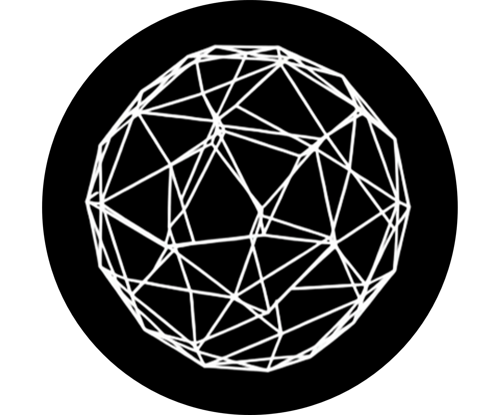
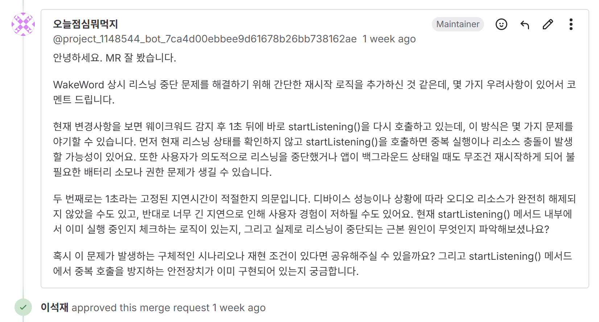
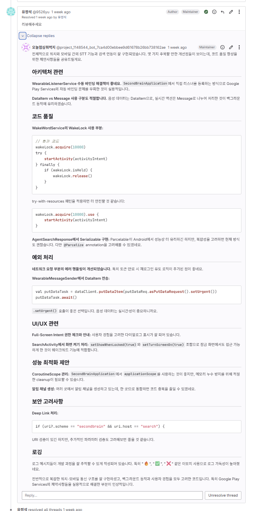
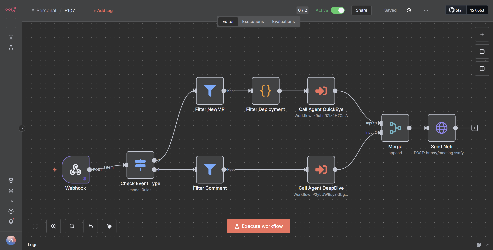
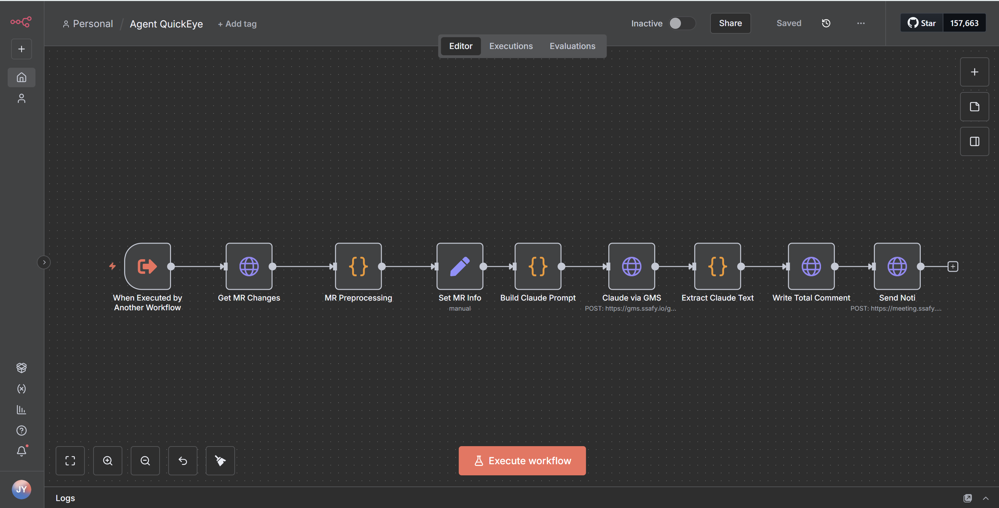
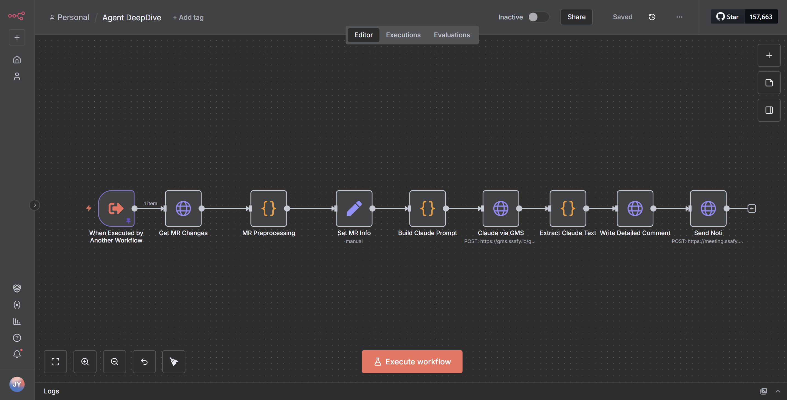
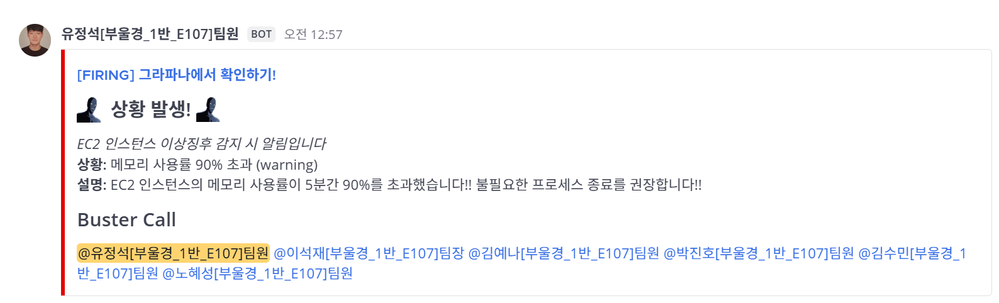
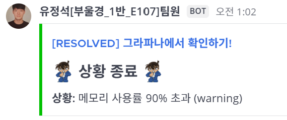

<div align="center">

# Second Brain



</div>

## 🔗**지식을 저장하고** 연결하여 **사용하세요**<br>

**지식을 노트로 저장**하고 **여러 디바이스에서 사용**하여 개인의 지식을 활용할 수 있습니다. **크롬 익스텐션과 MCP**를 통해 지식을 **쉽게 저장**하고 **쉽게 꺼내어** 연결된 지식과 인사이트를 얻으세요.<br/>

> ## Second Brain 프로젝트는
>
> 정보과부화 시대에 정보들은 기억 속에서 사라지거나 메모장 어딘가에 묻혀버려 장기기억으로 전환되지 못한다는 **문제의식**에서 출발했습니다. 우리의 서비스는 LLM과 인터넷을 통해 얻은 지식과 정보를 저장하고 연결하여 지식을 구조화하고, 쉽게 꺼내쓰면서 마치 **두 번째 뇌**를 가진 것과 같은 경험을 하게 해줍니다.

- **개발 기간** : 2025.10.02 ~ 2025.11.20 **(7주)**
- **플랫폼** : Web & App & Chrome Extension & Wear OS
- **개발 인원** : 6명 <br><br>

</div> <br>

## 🔎 목차

<div>

### <a href="#skills">📲 기능 구성</a>

### <a href="#techStack">🛠️ 기술 스택</a>

### <a href="#directories">📂 프로젝트 구조도</a>

### <a href="#systemArchitecture">🌐 시스템 아키텍처</a>

### <a href="#developers">🌟 팀원 구성</a>

### <a href="#projectDeliverables">📦 프로젝트 산출물</a>

</div>

<br>

## 📲 기능 구성

<a name="skills"></a>

<div align="center">

<div>

## Web

<table>
  <tbody align="center">
    <tr>
      <th style="text-align: center; width:100%;">메인화면</th>
    </tr>
    <tr>
      <td></td> 
    </tr>
  </tbody>
  <tbody align="center">
    <tr>
      <th style="text-align: center; width:100%;">메인화면 탐색</th>
    </tr>
    <tr>
      <td></td> 
    </tr>
  </tbody>
</table>

> 지식 노트는 연관성에 따라 연결되어 시각화됩니다<br>
> 노트는 저장되는 즉시 자동으로 관련 지식과 연결됩니다

<details>
<summary>기능 상세 보기</summary>
<div markdown="1">

<table>
  <tbody align="center">
    <tr>
      <th style="text-align: center; width:100%;">노트 작성</th>
    </tr>
    <tr>
      <td></td> 
    </tr>
  </tbody>
  <tbody align="center">
    <tr>
      <th style="text-align: center; width:100%;">노트 수정</th>
    </tr>
    <tr>
      <td></td> 
    </tr>
  </tbody>
  <tbody align="center">
    <tr>
      <th style="text-align: center; width:100%;">노트 삭제</th>
    </tr>
    <tr>
      <td></td> 
    </tr>
  </tbody>
  <tbody align="center">
    <tr>
      <th style="text-align: center; width:100%;">노트 검색</th>
    </tr>
    <tr>
      <td></td> 
    </tr>
  </tbody>
</table>
</div>
</details>

</div>

<div>

## Chrome Extension

크롬 익스텐션을 통해 웹에서 쉽게 정보를 저장하고 꺼내볼 수 있습니다

<details>
<summary>기능 상세 보기</summary>
<div markdown="1">

<table width="100%">
  <tbody align="center">
    <tr>
      <th style="text-align: center; width:100%;">드래그 기반 텍스트 저장</th>
    </tr>
    <tr>
      <td></td> 
    </tr>
  </tbody>
  <tbody align="center">
    <tr>
      <th style="text-align: center; width:100%;">드래그 기반 텍스트 추가</th>
    </tr>
    <tr>
      <td></td> 
    </tr>
  </tbody>
  <tbody align="center">
    <tr>
      <th style="text-align: center; width:100%;">전체 페이지 노트 저장</th>
    </tr>
    <tr>
      <td></td> 
    </tr>
  </tbody>
</table>

> 저장하고 싶은 정보를 드래그하여 context로 추가하거나 노트로 저장할 수 있고 URL 전체를 노트로 저장할 수 있습니다 <br>
> URL과 내용을 파싱하여 LLM을 통해 정리하고 노트로 저장합니다

<br/>

저장한 노트를 검색하고 내 Second Brain에 이미 저장되어 있는지 확인할 수 있습니다

<table>
  <tbody align="center">
    <tr>
      <th style="text-align: center; width:100%;">노트 검색</th>
    </tr>
    <tr>
      <td></td> 
    </tr>
  </tbody>
  <tbody align="center">
    <tr>
      <th style="text-align: center; width:100%;">드래그 텍스트 기반 노트 검색</th>
    </tr>
    <tr>
      <td></td> 
    </tr>
  </tbody>
</table>
<br/>

추가로 어떤 내용을 저장할 것인지 익스텐션을 통해 관리할 수 있습니다

<table>
  <tbody align="center">
    <tr>
      <th style="text-align: center; width:100%;">페이지 추가</th>
    </tr>
    <tr>
      <td></td> 
    </tr>
  </tbody>
  <tbody align="center">
    <tr>
      <th style="text-align: center; width:100%;">이미 추가된 페이지일 경우</th>
    </tr>
    <tr>
      <td></td> 
    </tr>
  </tbody>
</table>
<table>
  <tbody align="center">
    <tr>
      <th style="text-align: center" width="50%">추가한 페이지 삭제</th>
      <th style="text-align: center" width="50%">임시 노트 삭제</th>
    </tr>
    <tr>
      <td width="50%"></td>
      <td width="50%"></td>
    </tr>
  </tbody>
</table>
</div>
</details>

</div>

<div>

## MCP

Second Brain을 LLM 서비스와 연결하여 지식을 생성하고 꺼내서 새로운 인사이트를 얻어보세요

<details>
<summary>기능 상세 보기</summary>
<div markdown="1">

<table>
  <tbody align="center">
    <tr>
      <th style="text-align: center; width:100%;">저장 요청하기</th>
    </tr>
    <tr>
      <td></td> 
    </tr>
  </tbody>
  <tbody align="center">
    <tr>
      <th style="text-align: center; width:100%;">노트 생성</th>
    </tr>
    <tr>
      <td></td> 
    </tr>
  </tbody>
  <tbody align="center">
    <tr>
      <th style="text-align: center; width:100%;">다중 노트 생성</th>
    </tr>
    <tr>
      <td></td> 
    </tr>
  </tbody>
</table>

> 저장 요청을 통해 새로 알게 된 지식이나 대화 내용을 요약하여 노트로 저장합니다

<br>
<table>
  <tbody align="center">
    <tr>
      <th style="text-align: center; width:100%;">그래프 형성</th>
    </tr>
    <tr>
      <td></td> 
    </tr>
  </tbody>
</table>

> 저장된 노트는 관련성 있는 노트들과 자동으로 연결됩니다

<br>

<table>
  <tbody align="center">
    <tr>
      <th style="text-align: center; width:100%;">노트 검색</th>
    </tr>
    <tr>
      <td></td> 
    </tr>
  </tbody>
  <tbody align="center">
    <tr>
      <th style="text-align: center; width:100%;">노트 검색 결과</th>
    </tr>
    <tr>
      <td></td> 
    </tr>
  </tbody>
</table>

> Graph 검색을 지원하여 LLM이 더 많은 context와 연결성을 이해하고 답변할 수 있습니다

</div>
</details>

</div>

<div>

## Watch & Mobile

워치와 모바일에서 내가 저장한 노트를 자연어로 검색하고 확인할 수 있습니다

<details>
<summary>기능 상세 보기</summary>
<div markdown="1">
<table>
  <tbody align="center"> 
    <tr>
      <th style="text-align: center">검색</th>
      <th style="text-align: center">노트 검색 결과</th>
    </tr>
    <tr>
      <td width="50%"></td> 
      <td width="50%"></td>
    </tr>
  </tbody>
</table>

> 검색 결과를 모바일에서 확인하고 스와이프를 통해 연관 노트를 계속해서 서칭할 수 있습니다

<br/>

<table width="100%">
  <tbody align="center"> 
    <tr>
      <th style="text-align: center" colspan="2">음성 검색</th>
    </tr>
    <tr>
      <td width="50%"></td> 
      <td width="50%"></td>
    </tr>
  </tbody>
  <tbody align="center"> 
    <tr>
      <th style="text-align: center" colspan="2">음성 검색 알림</th>
    </tr>
    <tr>
      <td width="50%"></td> 
      <td width="50%"></td>
    </tr>
  </tbody>
</table>

</div>
</details>

</div>

</div>
<br>

## 🛠️ 기술 스택

<a name="techStack"></a>

<div align="center">

<a href="/exec/porting_manual.pdf" style="font-size:30px;">📃 **포팅 메뉴얼**</a>

</div>

---

<div align="center">

### 🌕 Frontend


<br>


<br>


|   **Category**   |          **Version**           |
| :--------------: | :----------------------------: |
|    **React**     |              v18               |
| **Tailwind CSS** | v3(web) / v4(Chrome Extension) |

<br>

</div>

---

<div align="center">

### 🌑 Backend


<br>


<br>


|   **Category**    | **Version** |
| :---------------: | :---------: |
|     **Java**      |     17      |
|  **Spring Boot**  |    3.5.7    |
| **Elasticsearch** |    8.7.1    |

</div>

---

<div align="center">

### 🤖 AI - Backend


<br>

<br>


| **Category** | **Version** |
| :----------: | :---------: |
|  **Python**  |    3.13+    |

<a href="/knowledge-graph-service/README.md" style="font-size:20px;">README-AI-Backend</a><br>
<a href="/agent-MCP/README.md" style="font-size:20px;">README-MCP-Server</a>

<br>
</div>

---

<div align="center">

### ⚙️ DevOps


<br>


<br>


|    **Category**    |        **Spec**        |
| :----------------: | :--------------------: |
| **Instance Type**  |       T2.XLARGE        |
|      **CPU**       |        4 vCPUs         |
|      **RAM**       |         16 GB          |
| **Storage (Disk)** | SSD: 320 GB, HDD: 6 TB |
|     **Docker**     |        v28.1.1         |
| **Docker Compose** |        v2.38.2         |
|    **Jenkins**     |         2.520          |
|     **Nginx**      |      nginx/1.18.0      |

</div>

<div align="center">

### 🤝 Collaboration


</div>

<br>

## 📂 프로젝트 구조도

<a name="directories"></a>

```
S13P31E107/...
├─ backend/secondbrain/...
│  ├─ Dockerfile
│  └─ main.py
│
├─ agent-MCP/...
│  ├─ services/...
│  ├─ .env-example
│  └─ main.py
│
├─ knowledge-graph-service/...
│  ├─ app/...
│  ├─ Dockerfile
│  └─ main.py
│
├─ extension/...
│  ├─ src/...
│  ├─ Dockerfile
│  ├─ package.json
│  └─ README.md
│
├─ frontend/...
│  └─ secondbrain/...
│     ├─ Dockerfile
│     ├─ src/...
│     └─ package.json
│
├─ mobile_watch/...
│  └─ secondbrain/...
│     ├─ build.gradle.kts
│     ├─ mobile/...
│     │   ├─ src/...
|     │   └─ build.gradle.kts
│     └─ wear/...
│         ├─ src/...
|         └─ build.gradle.kts
│
└─ Deploy/...
   ├─ jenkins, grafana, nginx.../...
   ├─ docker-compose.yml
   └─ Jenkinsfile
```

## 🌐 시스템 아키텍처

<a name="systemArchitecture"></a>

### 🖧 System Architecture

<div align="center">


</div>

### 🚀 Code Review Pipeline - n8n

<div align="center">

<table>
  <tr>
    <td align="center" width="50%"><b>Quick Review</b></td>
    <td align="center" width="50%"><b>Deep Review</b></td>
  </tr>
  <tr>
    <td align="center"></td>
    <td align="center"></td>
  </tr>
</table>
<table>
  <tr>
    <td align="center" width="33%"><b>Main Workflow</b></td>
    <td align="center" width="33%"><b>Quick Review Workflow</b></td>
    <td align="center" width="33%"><b>Detail Review Workflow</b></td>
  </tr>
  <tr>
    <td align="center"></td>
    <td align="center"></td>
    <td align="center"></td>
  </tr>
</table>

</div>

### 📢 Collaboration & Event Notification

<div align="center">

<table>
  <tr>
    <td align="center" width="50%"><b>❌ Jenkins Pipeline Failure</b></td>
    <td align="center" width="50%"><b>✅ Jenkins Pipeline Success</b></td>
  </tr>
  <tr>
    <td align="center"></td>
    <td align="center"></td>
  </tr>
  <tr>
    <td align="center" width="50%"><b>🗨️ Jira Issue Notification</b></td>
    <td align="center" width="50%"><b>🔀 Merge Request Created Notification</b></td>
  </tr>
  <tr>
    <td align="center"></td>
    <td align="center"></td>
  </tr>
  <tr>
    <td align="center" width="50%"><b>Server Resource Notification - Fireing</b></td>
    <td align="center" width="50%"><b>Server Resource Notification - Resolved</b></td>
  </tr>
  <tr>
    <td align="center"></td>
    <td align="center"></td>
  </tr>
</table>

</div>

<br>

## 🌟 팀원 구성

<a name="developers"></a>

<div align="center">

<div align="center">
<table>
    <tr>
        <td width="33%" align="center"> <a href="https://github.com/01seok">
             <br> 이석재 <br>(Team Leader & Backend) </a> <br></td>
        <td width="33%" align="center"> <a href="https://github.com/soomkim00">
             <br> 김수민 <br>(Backend) </a> <br></td>
        <td width="33%" align="center"> <a href="https://github.com/CometAve">
             <br> 노혜성 <br>(Full Stack) </a> <br></td>
    </tr>
    <tr>
      <td width="280px">
        <sub>
          - Elasticsearch와 Neo4j를 결합한 하이브리드 검색 엔진(RRF) 및 병렬 처리 구현<br>
          - RabbitMQ 기반의 비동기 메시지 처리를 통한 데이터 파이프라인 구축 및 트랜잭션 최적화<br>
          - Spring Scheduler와 STOMP 프로토콜을 활용한 실시간 리마인더 및 알림 시스템 개발<br>
          - 모바일 앱 백엔드 연동
        </sub>
      </td>
      <td width="280px">
        <sub>
          - 노트 CRUD, 다중 삭제 API 구현<br>
          - RabbitMQ 기반 리마인더 알림, 활성화 목록 조회 API 구현<br>
          - AWS S3 연결 및 파일 업로드 기능 구현<br>
          - 기능 단위 테스트 코드 작성<br>
          - 발표 스크립트 작성 및 발표
        </sub>
      </td>
      <td width="280px">
        <sub>
          - Authorization Code Pattern 기반 JWT 인증 및 Redis Refresh Token 로테이션 구현 <br>
          - Redis 기반 실시간 Draft 저장 시스템 구현 (멱등성 보장) <br>
          - 크롬 익스텐션 UI 개발 <br>
          - 크롬 익스텐션: Shadow DOM 격리, Drag-to-Search, OAuth 2.0 New Tab 방식 구현 <br>
          - Milkdown 에디터 통합, 성능 최적화 (3D UI, Vite)<br>
          - Docker 기반 로컬 개발 환경 구축
        </sub>
      </td>
    </tr>

</table>

<table>
    <tr>
        <td width="33%" align="center"> <a href="https://github.com/PPPP98">
         <br> 박진호 <br>(Backend & AI) </a> <br></td>
        <td width="33%" align="center"> <a href="https://github.com/yeneua">
         <br> 김예나 <br>(Frontend) </a> <br></td>
        <td width="33%" align="center"> <a href="https://github.com/seok0205">
         <br> 유정석 <br>(DevOps) </a> <br></td>
    </tr>
    <tr>
        <td width="280px">
          <sub>
            - Neo4j 지식 그래프 연결 서비스 구현<br>
            - LLM을 활용해 자연어 동적쿼리 작성 Agent 구현<br>
            - 동적쿼리와 유사도 검색을 결합한 검색 Agent 구현<br>
            - URL & text context 파싱 및 요약 Agent 구현<br>
            - FastAPI를 활용해 Agent & Neo4j 로직 엔드포인트 제공<br>
            - Neo4j 그래프 연결 비동기 처리를 위한 RabbitMQ 이벤트 컨슈머 워커 구성<br>
            - LangChain/LangGraph를 활용한 전체 Agent 워크플로우 설계 및 구현
          </sub>
        </td>
        <td width="280px">
          <sub>
            - 3D 그래프 시각화 및 인터렉션 구현<br> 
            - Glass UI 공통 컴포넌트 개발 및 최적화<br> 
            - 검색 기능 구현: 디바운싱, 무한 스크롤 적용을 통한 UX 최적화<br> 
            - 무한 스크롤 성능 최적화 (Intersection Observer 활용)<br> 
            - Android 앱 UX/UI 개발<br>
            - 서비스 전반 디자인 컨셉 수립<br>
            - 프로젝트 관리 및 문서화: Notion 기반 프로젝트 문서화, Jira 이슈 및 일정 운영
          </sub>
        </td>
        <td width="280px">
          <sub>
            - Android 앱 개발: Retrofit을 이용한 REST API 연동, 음성 인식 및 검색 기능 구현<br>
            - Wear OS 앱 개발: Wear Compose UI 구현, 음성 인식(STT) 및 모바일 기기와의 데이터 동기화(Data Layer API)<br>
            - Blue/Green 무중단 배포 파이프라인 구축 및 자동 롤백 시스템 구현<br>
            - n8n 기반 AI 코드 리뷰 자동화 워크플로우 구축<br>
            - Prometheus & Grafana 기반의 서버 리소스 모니터링 대시보드 구축<br>
            - MR, Server Resource 관련 이벤트, 오류 등을 MatterMost를 통해 자동 알림 구현
          </sub>
        </td>
    </tr>

</table>
</div>
<br>

</div>

<br>

## 📦 프로젝트 산출물

<a name="projectDeliverables"></a>

<h3>🖼️ 화면 설계서</h3>
<div align="center">


</div>

<h3>✅ Swagger API Docs</h3>
<details align="left">
  <summary>
    <strong>자세히</strong>
  </summary>

  <div align="center">

  
  
  </div>
</details>

<h3><a href="https://lemon-parrotfish-cb5.notion.site/2921d7b5e16e8090a358dce66d4f1d2c" target="_blank">🗓️ 일정표</a></h3>
<h3><a href="https://lemon-parrotfish-cb5.notion.site/2841d7b5e16e8133ace2e1505b37ca66" target="_blank">✅ 요구사항 정의서</a></h3>
<h3><a href="https://lemon-parrotfish-cb5.notion.site/2841d7b5e16e81a1a4dcc03071016a08" target="_blank">📋 기능 명세서</a></h3>
