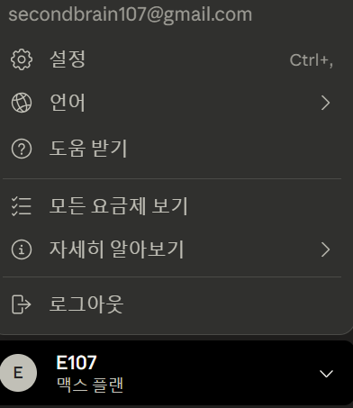
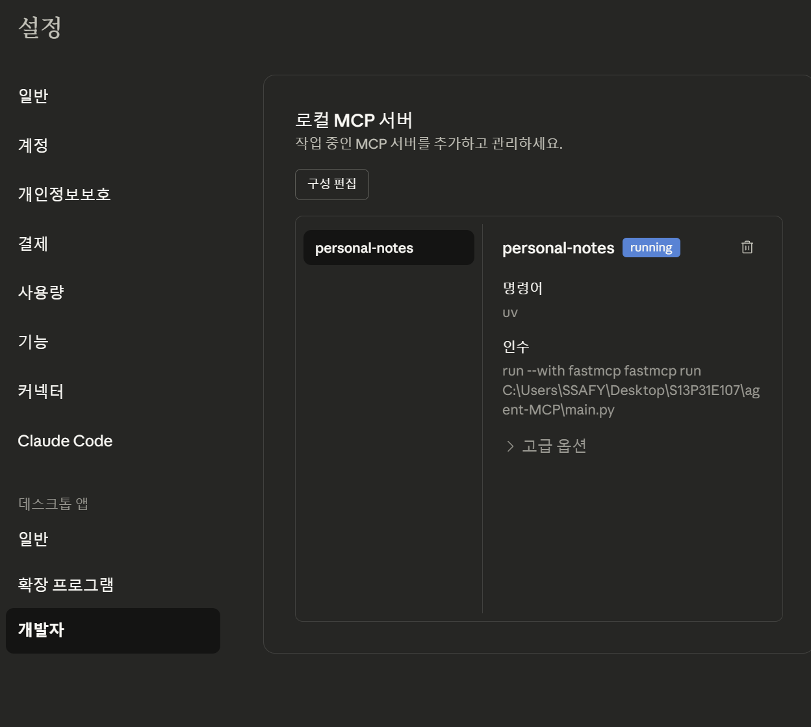
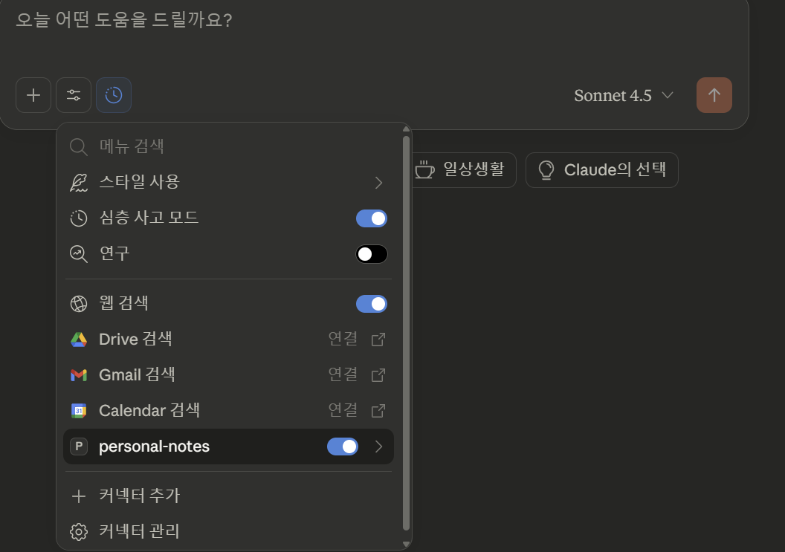

# Personal Notes Search MCP Server 🔍

개인 노트를 자연어로 검색할 수 있는 FastMCP 서버입니다. Claude Desktop과 연동하여 LLM이 여러분의 노트를 검색하고 활용할 수 있습니다.

## 📋 목차
- [설치](#설치)
- [환경 설정](#환경-설정)
- [Claude Desktop 연결](#claude-desktop-연결)
- [사용 방법](#사용-방법)


### 제공 도구

1. **search_personal_notes**: 자연어 + 시간 범위 검색
2. **create_personal_notes**: LLM 대화 내용 노트로 저장( 미구현 )

## 🚀 설치

### 1. 필수 요구사항

- Python 3.13+
- uv (Python 패키지 관리자)
- Claude Desktop

### 2. 프로젝트 클론

```
git clone [repository-url]
cd agent-MCP
```

### 3. 의존성 설치

```
# uv 사용
uv sync
```

**requirements**
```
fastmcp>=2.11.4
httpx
pydantic
python-dotenv
```

## ⚙️ 환경 설정

### 1. .env 파일 생성

프로젝트 루트에 `.env` 파일 생성:


Windows
Command Prompt (cmd):

```bash
copy .env-example .env
```
PowerShell:

```powershell
Copy-Item .env-example .env
```
Git Bash:

```bash
cp .env-example .env
```
Linux / macOS
```bash
cp .env-example .env
```
```
# 환경변수
API_KEY=your-api-key
API_BASE_URL=https://api.brainsecond.site/
```

### 2. API 키 발급

백엔드 서버에서 API 키를 발급받아 `.env` 파일에 설정하세요.

## 🔗 Claude Desktop 연결

### 방법 1: FastMCP CLI 사용 (권장)
- 가상환경 활성화
```
source .venv/Script/activate
```
- 프로젝트 폴더에서 실행
```
fastmcp install claude-desktop main.py --name personal-notes
```

### 방법 2: 수동 설정

### 1. **설정 파일 열기**
Windows:
```
%APPDATA%\Claude\claude_desktop_config.json
```

### 2. **설정 추가**
```
uv run python generate_config.py
```
- 위 명령어로 현재 내 컴퓨터 경로로 config.json 생성
```
{
  "mcpServers": {
    "personal-notes": {
      "command": "uv",
      "args": [
        "--directory",
        "yout-directory-path",
        "run",
        "python",
        "main.py"
      ]
    }
  }
}
```

> ⚠️ 경로를 실제 프로젝트 위치로 변경하세요!

### 3. **Claude Desktop 재시작**

- Claude Desktop 완전 종료
- 다시 실행

### 4. **설치 확인**


- 이름 -> 설정

- 개발자 모드에서 로컬 MCP 구동 확인 가능

- 채팅창 도구에서 설정 확인 가능


## 📖 사용 방법

### Claude Desktop에서 사용

Claude에게 다음과 같이 요청하세요:

```
1. "내 노트에서 FastAPI 관련 내용 찾아줘"
2. "지난주에 작성한 노트 보여줘"
3. "머신러닝 공부한 내용 요약해줘"
4. "오늘 작성한 노트로 일일 보고서 작성해줘"
```

### 로컬 테스트

```
# MCP 서버 직접 실행
uv run python main.py
```


### 검색 로직 수정

`services/search_service.py`의 `SearchService` 클래스를 수정하세요.

## 🐛 트러블슈팅

### 문제: Claude Desktop에서 서버가 연결되지 않음

**해결:**
1. 경로가 정확한지 확인 (슬래시 `/` 사용)
2. Claude Desktop 재시작
3. 로그 확인: `%APPDATA%\Claude\logs`

### 문제: API 키 인증 실패

**해결:**
1. `.env` 파일의 `API_KEY` 확인
2. 백엔드 서버 실행 확인
3. 네트워크 연결 확인

### 문제: 검색 결과가 없음

**해결:**
1. 백엔드 API 서버가 실행 중인지 확인
2. API_BASE_URL이 올바른지 확인
3. 노트 데이터가 실제로 존재하는지 확인

### 문제: ImportError 발생

**해결:**
```
# 의존성 재설치
uv sync --reinstall

# 또는
pip install -r requirements.txt --force-reinstall
```

## 📝 환경 변수 예시

`.env.example` 파일:

```
# API 서버 주소
API_BASE_URL=https://api.brainsecond.site/ai/api/v1/agents

# API 인증 키 (실제 키로 교체하세요)
API_KEY=nts_your_api_key_here
```
