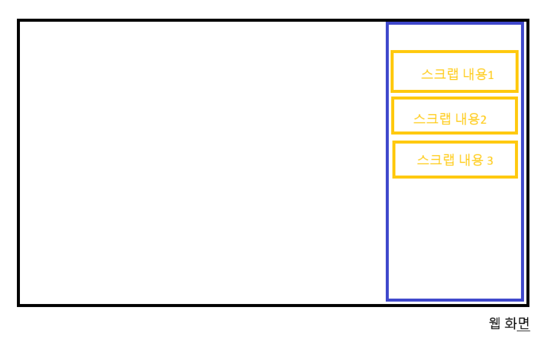

# 2025.10.14

# 아이디어 기획 <웹 스크랩북>

갤키플에서 영감을 받아…

갤키플에서 설명한 앱 전환의 번거로움이 컴에서도 적용?

웹 에서 자료를 수집하고 또 정리는 다른 곳에 해야함

## 생각한 계기

- 자료 조사할 때
- 브라우저 탭 백개 띄워놓고 조사하는데
- 막상 필요한 정보는
- 각 탭에서 한두줄, 한 문단 정도 혹은 이미지 한두장
- 브라우저 계속 왔다갔다 해야되고
- 또 저는 똥컴이라 브라우저가 계속 리프레시 됨 → 읽던 부분에서 포커스가 사라지고 최상단으로 이동함 ㅠ
- 이런 내용들을 다 정리하기에는 또 막상 나중에 보면 필요 없는 내용들도 있음
- 혹은 다른 블로그에서 이전에 정리한 내용을 포함하는 더 좋은 글들을 발견하기도 함
- 이런 문제를 해결하고
- 자료 조사하는 내용을 더 잘 정리할 수 없을까?하는 생각에서 떠올림

## 컨셉

> 여러 사이트에 흩어져 있는 정보를 수집하고 자유롭게 편집, 그룹화 해서 하나의 정리된 결과물로 만들어내기

## 기능

1. 정보 수집
   1. 텍스트 하이라이트
   2. 이미지/영상/요소 캡쳐
   3. 문서 파일(pdf, xlsx, docs 등)
   4. 자동 출처 저장
2. 보드 (수집한 정보들이 모이는 공간)
   1. 블록들 모아보는 공간
   2. 블록 편집
   3. 그룹 기능 : 주제별 그룹 생성(크롬에 탭 그룹 같은거라고 생각)
3. ai
   1. 중복 제거 : 여러 곳에서 모은 정보들 중 중복된 내용 제거 및 통합
   2. 내용 검증 : 수집한 정보 신뢰도 검사
   3. 그룹 단위 요약 : 그룹 단위별로 블록 내용을 종합하여 핵심 요약

## 사용자 시나리오

대학생 '지민'이 "양자 컴퓨팅의 미래"라는 주제로 리포트를 쓴다고 가정해 보겠습니다.

1. **(수집)** 지민은 10개의 브라우저 탭을 열어 관련 기사와 논문을 읽습니다.
   - A 뉴스 기사에서 **핵심 원리 한 문단**을 드래그하여 하이라이트하고, `[스크랩북에 추가]` 버튼을 누릅니다.
   - B 기술 블로그에서 **중요한 이미지**를 우클릭하여 스크랩북에 추가합니다.
   - C 논문 사이트에서 **인용하고 싶은 문장**을 하이라이트하여 추가합니다.
2. **(정리)** 사이드바의 '웹 스크랩북'에는 방금 추가한 텍스트와 이미지 조각들이 '블록' 형태로 쌓여 있습니다.
   - 지민은 "기본 개념"이라는 이름의 **새로운 그룹**을 만듭니다.
   - A 기사와 C 논문에서 가져온 텍스트 블록을 "기본 개념" 그룹 안으로 드래그하여 옮깁니다.
   - "시장 전망" 그룹을 하나 더 만들어 B 블로그의 이미지와 관련 스크랩들을 넣습니다.
3. **(생성)** 스크랩북에 직접 **"내 생각 정리"라는 메모 블록**을 추가하여 자신의 아이디어를 적습니다.
4. **(요약)** "기본 개념" 그룹의 헤더에 있는 `[AI 요약]` 버튼을 누릅니다. 잠시 후, 그룹 안에 있던 텍스트 조각들의 핵심 내용만 간추린 **'요약 블록'**이 새롭게 생성됩니다.
5. **(활용)** 최종적으로 잘 정리된 내용들을 `[전체 복사]` 버튼으로 클립보드에 복사하여 리포트 초안에 붙여넣습니다. 각 블록에는 원문 링크가 자동으로 포함되어 있어 출처를 다시 찾을 필요가 없습니다.

## 크롬 확장 프로그램

제가 생각한 건 이런 느낌쓰입니다요

버튼 누르면 사이드바가 나옴

스크랩 내용들이 여러개 모인 저 사이드 바가 ‘보드’고

스크랩 내용들을 각각 ‘블록’이라고 생각

## 시장 조사

### 유사 서비스

**Readwise**

> 웹, 기사 등에서 수집한 하이라이트를 복습하고 노션같은 노트 앱에 자동으로 모아주는 서비스

- 다양한 출처에서 정보 수집
- 노트앱과 연동

→ 다른 점

- 이 서비스는 ‘반복’과 ‘학습’에 집중되어 있음
- 하이라이트 한 내용을 메일로 다시 보내줌 << 이 기능이 핵심인 서비스인듯
- 유료임
- [기능 설명해놓은 블로그](https://www.canda.blog/reader-by-readwise/)

**Glasp**

> 유튜브 영상 요약 및 필기 기능

- 크롬 확장 프로그램
- ai 기반 유튜브 영상 요약 및 스크립트 추출
- 메모 작성
- 유튜브 스크립트 하이라이트

**Zotero**

> 서적 관리 시스템

- 논문 정리할 때 주로 사용
- 대학원생 사용 多
- 자료 수집 : 논문, 기사, 웹
- 하이라이트 기능
- [블로그](https://chanmuzi.tistory.com/489#google_vignette)

**밀라노트**

- 피그잼이랑 유사

### 수요 조사

- **시장 잠재력: 거대하고 성장하는 시장**
  - 글로벌 생산성 소프트웨어 시장 규모 약 **80조 원**
  - 연평균 **13.8%**의 가파른 성장세
  - 정보를 효율적으로 관리하려는 강력한 글로벌 수요 입증
  - 탄탄한 시장을 기반으로 한 높은 사업 잠재력
- **핵심 타겟: 구매력 있는 명확한 고객층**
  - 전 세계 대학생 및 연구원, **2억 3,500만 명**의 거대한 시장
  - Zotero, Mendeley 등 전문 도구 사용으로 증명된 자료 정리 니즈
  - '리포트/논문 작성'이라는 명확한 목표를 가짐
  - 작업 효율을 높이는 서비스에 대한 높은 수용도와 지불 의사
- **핵심 기능: 검증된 수요의 강력한 조합**
  - **정보 수집(웹 클리핑)**: Notion 등 수천만 명이 사용하는 이미 검증된 기능
  - **AI 요약**: 연 25% 이상 폭발적으로 성장하는 새로운 핵심 기능
  - 검증된 수요와 성장하는 수요를 '하나의 워크플로우'로 결합
  - 두 시장의 시너지를 통한 강력한 경쟁력 확보

## 팀원 회의

- 기존의 ai 에이전트로 충분히 활용 가능한 서비스인 것 같다
