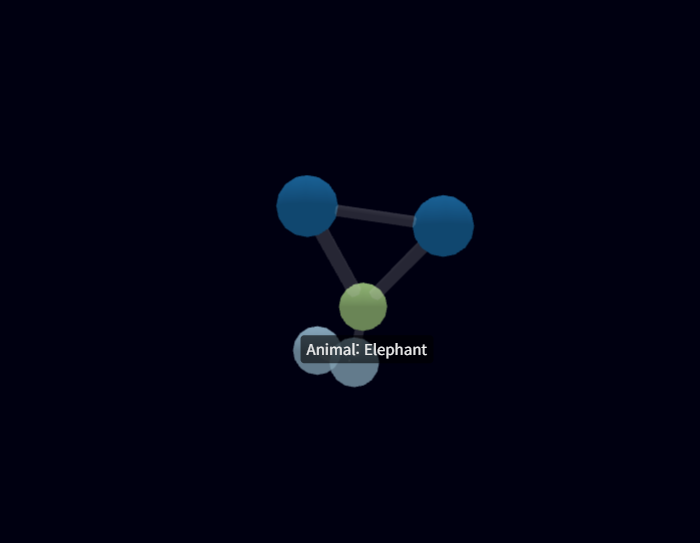

# 2025.10.31

## 그래프 데모 테스트

```html
<!DOCTYPE html>
<html>
  <head>
    <style>
      body {
        margin: 0;
      }
      #graph-container {
        width: 100vw;
        height: 100vh;
      }
    </style>

    <script src="//cdn.jsdelivr.net/npm/3d-force-graph"></script>
  </head>

  <body>
    <div id="graph-container"></div>

    <script>
      const myData = {
        nodes: [
          { id: "Apple", group: "Fruit", size: 10 },
          { id: "Banana", group: "Fruit", size: 8 },
          { id: "Car", group: "Things", size: 8 },
          { id: "Door", group: "Things", size: 8 },
          { id: "Elephant", group: "Animal", size: 5 },
        ],
        links: [
          { source: "Apple", target: "Banana", value: 5 },
          { source: "Elephant", target: "Banana", value: 3 },
          { source: "Car", target: "Door", value: 3 },
          { source: "Car", target: "Elephant", value: 4 },
          { source: "Door", target: "Elephant", value: 4 },
        ],
      };

      // 그래프 생성
      const Graph = ForceGraph3D()(document.getElementById("graph-container")) // HTML 요소와 연결
        .graphData(myData)

        // 노드 색상
        .nodeAutoColorBy("group")

        // 노드 크기
        .nodeVal("size")

        // 선 두께
        .linkWidth("value")

        // 선 투명도
        .linkDirectionalParticles(1)
        .linkDirectionalParticleWidth(0.8)

        // hover 시 라벨 표시
        .nodeLabel((node) => `${node.group}: ${node.id}`)
        .onNodeHover(
          (node) => (document.body.style.cursor = node ? "pointer" : null)
        );
    </script>
  </body>
</html>
```

## 결과 화면


